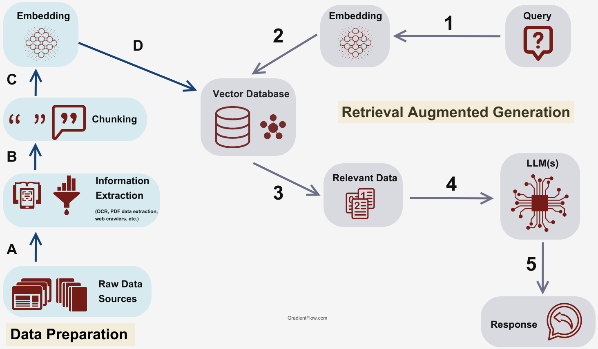

# RAG model

RAG model on [nezams](https://nezams.com/) (it's a legal search
engine). This will simplify the user's journey to access legal
documents.

## Design Process

## Implementation

- **Web Scraping:**  BeautifulSoup4 (used where allowed—no sneaky scraping here!)
- **Embedding Models:**  text-embedding-3-small-model 
- **Vector Databases:**  ChromaDB
- **Chatbot:** ChatGPT 4o 
- **UI:** Gradio

## Authors

[@mohammed-Alhusini](https://www.github.com/mohammed-Alhusini)
